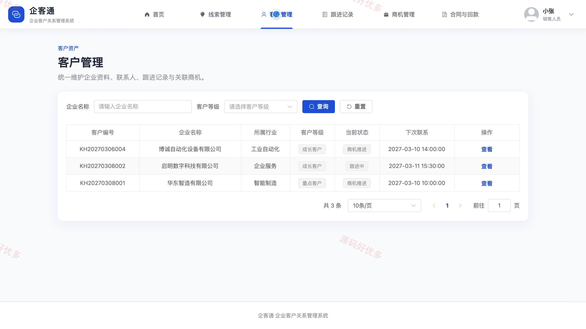
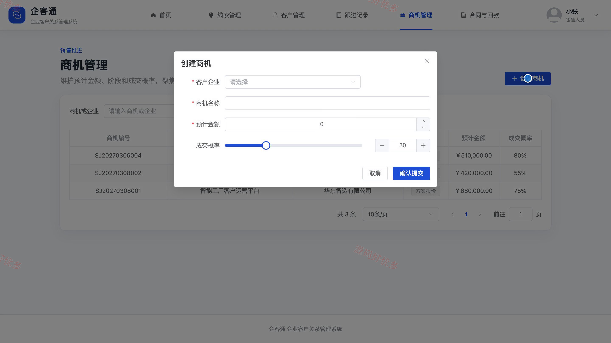
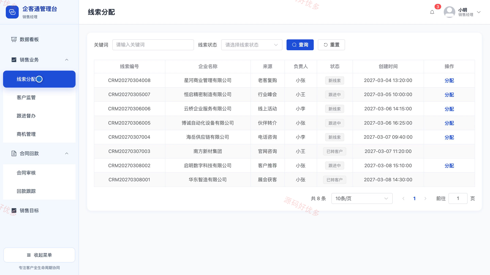
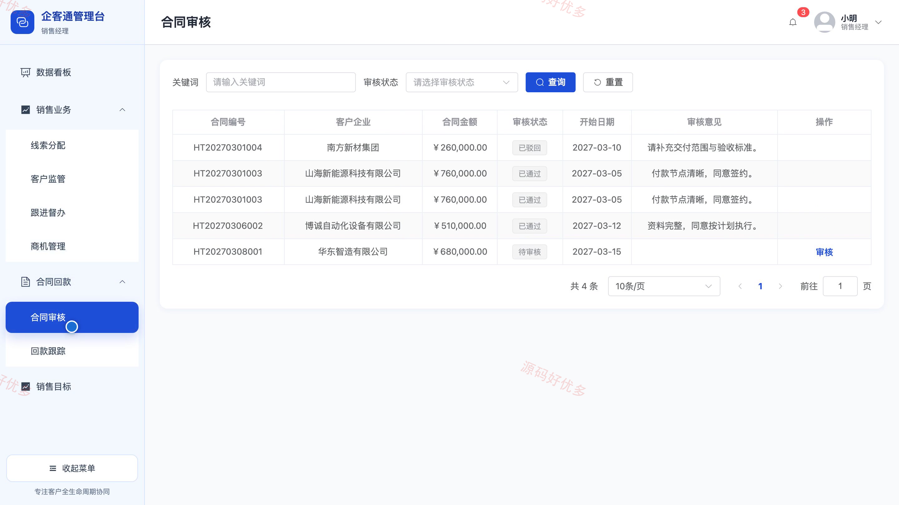
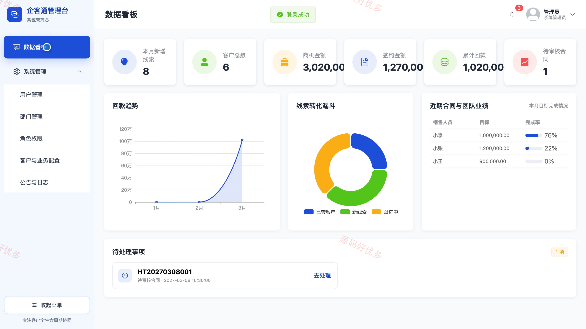
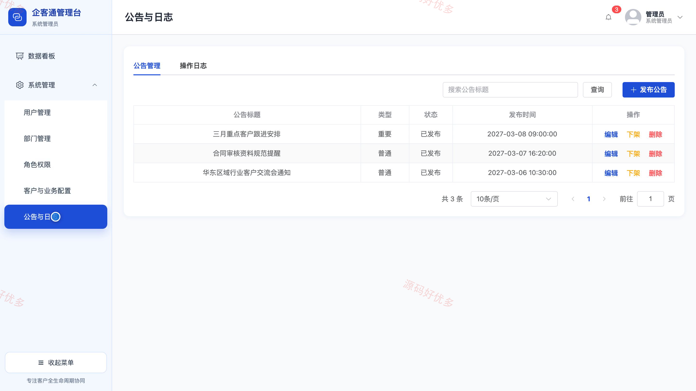

# bs073A
bs073A企业客户关系管理系统
## 源码问题查看主页咨询

### 一、关键词
企业客户关系管理、销售线索管理、客户跟进管理、销售商机管理、合同回款管理

### 二、作品包含
源码+数据库+万字设计文档+PPT+全套环境和工具资源+本地部署教程

### 三、项目技术
前端技术： Html、Css、Js、Vue3.4、Element-Plus
后端技术：Java、SpringBoot3.2.0、MyBatis-Plus

### 四、运行环境（以下版本亲测，其他版本兼容性请自行测试）
开发工具：IDEA/eclipse + VSCODE

数据库：MySQL5.7+（共16张表）

数据库管理工具：Navicat10以上版本

环境配置软件： JDK17 + Maven

前端Nodejs：20

浏览器：谷歌浏览器

### 五、项目介绍
项目编号：bs073A

系统围绕企业客户全生命周期展开，支持销售人员管理线索、客户、联系人、跟进记录、商机、合同与回款，销售经理负责团队业务监管、合同审核和业绩目标，系统管理员维护账号、部门、权限、业务字典、公告与操作日志。

角色：销售人员、销售经理、系统管理员

销售人员功能：线索新增与维护、客户资料与联系人维护、跟进记录与提醒、商机阶段与金额维护、合同提交与进度查看、回款信息查询。

销售经理功能：数据看板与业绩统计、线索分配、客户监管与归属协调、跟进督办、团队商机管理、合同审核、回款跟踪、销售目标维护。

系统管理员功能：数据概况统计、用户状态管理、部门信息维护、角色与菜单权限配置、客户分类配置、业务字典维护、公告管理、操作日志查询。

### 六、运行截图

